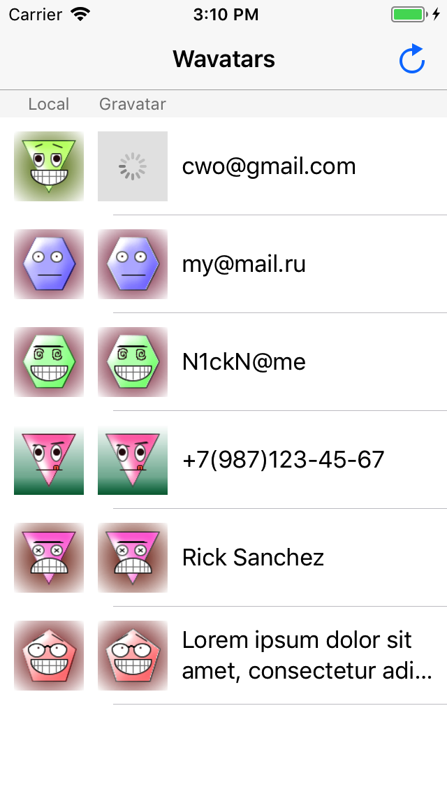

# WavatarSwift

[](http://cocoapods.org/pods/WavatarSwift)
[](http://cocoapods.org/pods/WavatarSwift)
[](http://cocoapods.org/pods/WavatarSwift)

## Example



To run the example project, clone the repo, and run `pod install` from the Example directory first.

```swift
WavatarSwift.generate(string: string, size: 50)
```

Also you can generate wavatar in background with completion (in main thread):

```swift
WavatarSwift.generate(string: this.string, size: WavatarSwift.maxSize) {
    string, image in
    imageView.image = image
}
```

Limitation:

* Image size is limited by 80.

## Requirements

* iOS 8+.
* Any MD5 implementation. You need use it in WavatarSwiftMD5 protocol extension for class WavatarSwift.

```swift
extension WavatarSwift: WavatarSwiftMD5 {
    public class func md5(_ string: String) -> String {
        return MD5(string)
    }
}
```

## Installation

WavatarSwift is available through [CocoaPods](http://cocoapods.org). To install
it, simply add the following line to your Podfile:

```ruby
pod 'WavatarSwift'
```

## Author

Anton Serebryakov, serebryakov.anton@gmail.com

## License

WavatarSwift is available under the MIT license. See the LICENSE file for more info.
